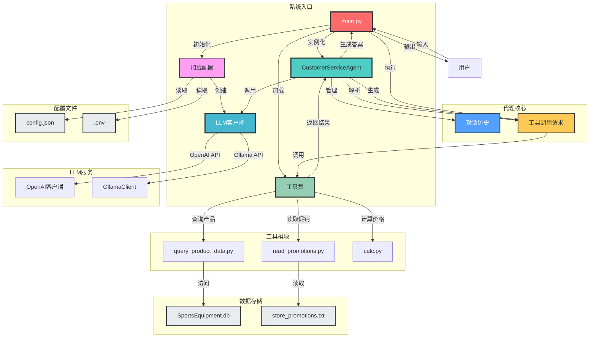

# ReAct_AI_Agent项目架构图

## 架构图说明

### 核心模块

1. **主程序模块 (main.py)**
   - 系统入口点，负责初始化和协调各模块
   - 处理用户输入和输出
   - 解析代理响应并执行工具调用

2. **代理模块 (CustomerServiceAgent)**
   - 实现ReAct模式的思考-行动-观察循环
   - 管理对话历史
   - 生成工具调用请求
   - 整合工具结果生成最终答案

3. **LLM客户端模块**
   - 封装LLM服务调用接口
   - 支持OpenAI API和Ollama API
   - 处理API请求和响应

4. **工具模块**
   - 提供三种核心工具：
     - 产品查询工具
     - 促销信息工具
     - 价格计算工具
   - 与数据存储交互

5. **数据存储**
   - SQLite数据库：存储产品信息
   - 文本文件：存储促销信息

6. **配置文件**
   - JSON配置：LLM设置和系统参数
   - 环境变量：API密钥等敏感信息

### 交互关系

- 主程序模块协调所有其他模块
- 代理模块是系统的核心，连接LLM客户端和工具模块
- LLM客户端负责与外部LLM服务通信
- 工具模块与数据存储交互获取所需信息
- 配置文件为整个系统提供参数设置

### 数据流向

1. 用户输入问题
2. 主程序将问题传递给代理
3. 代理调用LLM生成响应
4. 如果需要工具调用，代理生成工具请求
5. 主程序执行工具调用
6. 工具与数据存储交互获取信息
7. 工具结果返回给代理
8. 代理整合结果生成最终答案
9. 主程序将答案输出给用户