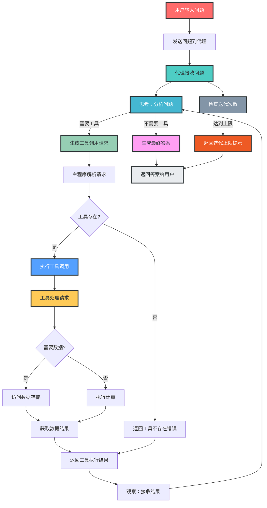

# ReAct_AI_Agent核心流程流程图

## 流程图说明

### 流程步骤

1. **用户输入**：用户在命令行输入问题

2. **代理处理**：
   - 代理接收问题
   - 分析问题并决定是否需要工具调用
   - 检查迭代次数是否达到上限

3. **思考过程**：代理使用LLM分析问题，确定需要的行动

4. **工具调用**：
   - 生成工具调用请求
   - 主程序解析请求
   - 检查工具是否存在
   - 执行工具调用

5. **工具执行**：
   - 工具处理请求
   - 访问数据存储或执行计算
   - 返回工具执行结果

6. **观察反馈**：
   - 代理接收工具执行结果
   - 基于结果继续思考或生成答案

7. **最终输出**：
   - 生成最终答案
   - 返回给用户

### ReAct模式说明

该流程图展示了ReAct（Reasoning + Acting）代理的核心工作原理：

- **思考（Reasoning）**：代理分析问题，确定需要的信息或行动
- **行动（Acting）**：代理调用适当的工具获取信息或执行操作
- **观察（Observing）**：代理接收工具执行结果，作为后续思考的依据

这种循环过程使代理能够处理复杂的问题，逐步获取所需信息，并最终生成准确的答案。

### 关键决策点

1. **是否需要工具**：代理根据问题分析决定是否需要调用工具
2. **工具是否存在**：主程序检查请求的工具是否在可用工具列表中
3. **是否需要数据**：工具决定是否需要访问外部数据存储
4. **迭代次数检查**：防止无限循环，确保代理在合理时间内返回结果

### 数据流向

- 用户问题 → 代理 → LLM → 工具调用请求 → 工具 → 数据存储 → 工具结果 → 代理 → 最终答案 → 用户

### 设计优势

1. **模块化**：流程清晰，各部分职责明确
2. **可扩展性**：容易添加新的工具或扩展现有功能
3. **错误处理**：包含工具不存在等异常情况的处理
4. **性能控制**：通过迭代次数限制防止无限循环
5. **可解释性**：ReAct模式提供了代理思考和行动的清晰轨迹